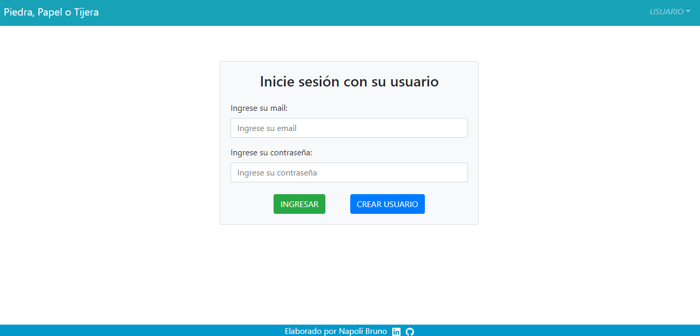
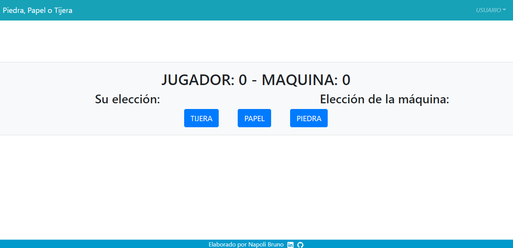

# Juego Piedra💎, Papel📄 o Tijera✂️ con Login

## App Info

### Descripción aplicación
> Aplicación en la que puedes crearte un usuario y jugar al famoso piedra, papel o tijera mientras se guardan tus estadísticas.




### Lenguajes
>Vue.js - Node.js - MongoDB - Bootstrap.

### Iniciar aplicación
>La aplicación está conectada a la base de datos del servisio de MongoDB Atlas,
>por lo que debe crear un archivo .env y seguir el modelo del archivo .env.example para conectarlo a su propia base de datos 
>en Atlas.

```bash
# Instalar dependencias
npm install

# Iniciar Vue en el puerto 8080: http://localhost:8080
npm run serve

#Iniciar servidor en el puerto 3030: http://localhost:3030
npm run start
```

### Autor
>Napoli Bruno